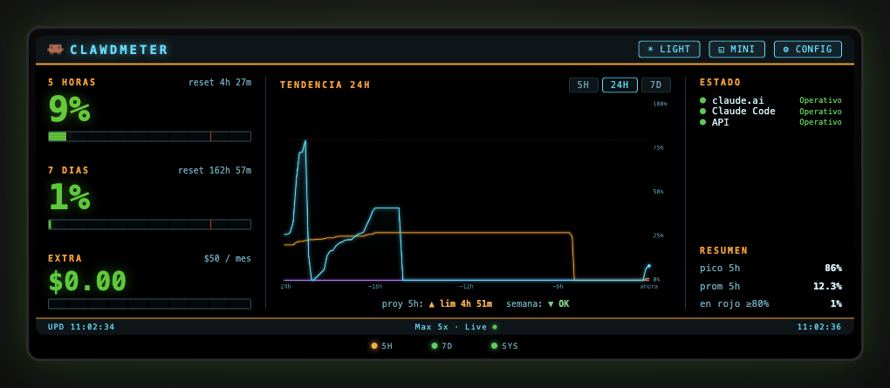

# Clawdmeter

Monitor fisico de uso de Claude en tiempo real. Un ESP32 con pantalla LCD que muestra tu consumo de Claude (limites de 5 horas, 7 dias y extra usage) consultando la API interna de claude.ai a traves de un proxy local. Incluye una PWA instalable como widget de escritorio.

<p align="center">
  <a href="https://www.waveshare.com/esp32-s3-lcd-1.47b.html">
    
  </a>
</p>

<p align="center">
  
</p>

## Como funciona

```
Brave Browser (perfil dedicado, CDP)
  -> Playwright conecta via CDP
  -> fetch a claude.ai/api (usa cookies del browser, sin API keys)
  -> Express server en localhost:3456
  -> ESP32 lee /api/usage cada 60s
  -> PWA lee /api/usage cada 60s
```

No usa API keys ni session keys. La autenticacion vive en el perfil del browser — te logueas una vez y listo.

## Estructura

```
├── start.sh                     # Arranca Brave + proxy
├── .env                         # Config (puertos)
├── proxy/
│   ├── server.js                # Entry point (Express + rutas)
│   ├── lib/
│   │   ├── browser.js           # Conexion Brave/CDP, fetch a claude.ai
│   │   └── usage.js             # Cache y refresh de datos de uso
│   └── public/                  # PWA (widget de escritorio)
│       ├── index.html           # Dashboard web instalable
│       ├── manifest.json        # Manifest PWA
│       ├── icon.svg             # Icono de la app
│       └── sw.js                # Service worker
└── firmware/Clawdmeter/
    ├── Clawdmeter.ino           # Main (setup, loop, globals)
    ├── config.ino               # Configuracion (NVS)
    ├── colors.ino               # Backlight, gradientes, LED integrado + tira externa
    ├── alerts.ino               # Alertas por umbral (buzzer + parpadeo)
    ├── display.ino              # Pantalla TFT (UI completa)
    ├── network.ino              # WiFi, NTP, fetch de datos con reintentos
    ├── touch.ino                # Boton touch (cambio de pantalla)
    ├── weather.ino              # Clima (Open-Meteo)
    └── webconfig.ino            # Web server de configuracion
```

## Hardware

- **Board:** Waveshare ESP32-S3 LCD 1.47" (version B)
- **Display:** ST7789, 172x320px (landscape)
- **LED integrado:** WS2812 (GPIO38) — efecto ambiental con cambio fluido de color
- **Tira externa:** 3x WS2812B encadenados (GPIO2) — un LED por metrica (5h / 7 dias / extra), gradiente verde a rojo segun uso
- **Boton touch:** TTP223 (GPIO10) — cambia de pantalla (uso / reloj+clima)
- **Buzzer (opcional):** pasivo (GPIO11 por defecto, configurable) — beep al cruzar umbrales de uso

### Conexiones

El boton touch, la tira de LEDs externa y el buzzer son los componentes a cablear; el display y el LED integrado ya vienen en la placa. El buzzer es opcional.

```
        Waveshare ESP32-S3 LCD 1.47" B
        +------------------------------+
        |                              |
        |   [ LCD ST7789 320x172 ]     |
        |                              |
        |  GPIO38 WS2812 (integrado)   |  <- ambiental, no se cablea
        |                              |
        |  VBUS   GND   GPIO2  GPIO10  |  (VBUS = 5V; en la placa dice VBUS)
        +----|------|------|------|----+
             |      |      |      |
             |      |      |      +-----------------------+
             |      |      |                              |
             |      |      |                        +-----------+
             |      |      |     TTP223 (touch)     |  VCC  3V3 |  (a 3V3 de la placa)
             |      |      |                        |  GND  GND |
             |      |      |                        |  I/O  GPIO10
             |      |      |                        +-----------+
             |      |      |
             |      |      |   Tira 3x WS2812B (VBUS/5V, GND comun con la placa)
             |      |      |   +--------+   +--------+   +--------+
             |      |      +-->| DIN    |   |        |   |        |
             |      |          |  LED 0 |DO>| LED 1  |DO>| LED 2  |
             |      |          | (5h)   |   | (7dias)|   | (extra)|
             |      |          +--------+   +--------+   +--------+
             |      |             |  |         |  |         |  |
             +------|-------------+  | VBUS ---+  | VBUS ---+  |   <- VBUS/5V a cada LED
                    +----------------+ GND -------+ GND ------+   <- GND comun
```

| Senal | Pin placa | Componente |
|-------|-----------|------------|
| Datos LEDs | GPIO2 | DIN del primer WS2812B de la tira |
| Boton | GPIO10 | I/O del TTP223 (activo alto) |
| Buzzer (opcional) | GPIO11 | "+" del buzzer pasivo (el otro pin a GND) |
| Alimentacion tira | VBUS (5V) | VCC de los 3 WS2812B |
| Tierra comun | GND | GND de la tira, el TTP223 y el buzzer |
| TTP223 VCC | 3V3 | alimentacion del modulo touch |

> La tira de LEDs necesita 5V (pin **VBUS** de la placa) y **tierra comun**. Para 3 LEDs el consumo es bajo y puede salir del VBUS de la placa; con tiras mas largas usar fuente externa.

> **Buzzer:** pasivo (se controla con PWM/tono), dos cables — uno a GPIO11 y el otro a GND. El pin es configurable desde la web UI; pines seguros: 11, 12, 13, 14, 21. Pin `0` = sin sonido (solo parpadeo del LED).

## Setup

### Proxy (Mac/PC)

```bash
# Primera vez: abrir Brave para loguearse en claude.ai
./start.sh --login

# Despues: proxy en background
./start.sh
```

Requiere: Node.js, pnpm, Brave Browser, Playwright (`pnpm install` se ejecuta automaticamente).

### PWA (Widget de escritorio)

1. Con el proxy corriendo, abrir `http://localhost:3456/` en Chrome
2. Click en el icono de instalar en la barra de URL
3. Se abre como ventana standalone — un widget sin barra del browser

Muestra los mismos datos que el ESP32 con colores gradientes y glow dinamico segun el uso.

### ESP32 (Arduino IDE)

1. Board: ESP32S3 Dev Module, 16MB Flash, OPI PSRAM, USB CDC On Boot Enabled
2. Librerias: TFT_eSPI, ArduinoJson, WiFiManager (by tzapu), Adafruit NeoPixel
3. Configurar `User_Setup.h` de TFT_eSPI para la placa Waveshare
4. Flashear `firmware/Clawdmeter/Clawdmeter.ino`
5. Conectar al AP "Clawdmeter-Setup" para configurar WiFi
6. Configurar IP del proxy en `http://clawdmeter.local`

## Que muestra

| Dato | Descripcion |
|------|-------------|
| 5 HORAS | Uso en la ventana de 5h + tiempo para reset |
| 7 DIAS | Uso en la ventana de 7 dias + tiempo para reset |
| EXTRA USAGE | Creditos gastados / limite mensual (en USD) |
| Plan | Tipo de suscripcion (Max 5x, Pro, etc.) |
| Upd | Ultima actualizacion exitosa (cambia a rojo si falla) |
| Tira LED | 3 LEDs verde (0%) a rojo (100%): 5h, 7 dias y extra (azul tenue si no aplica) |
| LED integrado | Color ambiental que cambia suavemente (decorativo) |
| Buzzer | Beep + parpadeo al cruzar umbral de aviso (~80%) o critico (~95%) |

## Configuracion del ESP32

Acceder a `http://clawdmeter.local` desde cualquier dispositivo en la misma red:

- IP y puerto del proxy
- Intervalo de refresco
- Brillo LCD y LED
- Invertir pantalla 180°
- Zona horaria
- Alertas: on/off, umbrales de aviso/critico y GPIO del buzzer
- Password de admin

## Por que un browser?

Claude.ai bloquea requests directos (Cloudflare + TLS fingerprinting). La unica forma confiable de acceder a la API interna es desde un browser real. Brave funciona porque es un binario separado de Chrome, asi no interfiere con tu navegador principal.

---

Inspirado en [ClaudeGauge](https://github.com/dorofino/ClaudeGauge).
