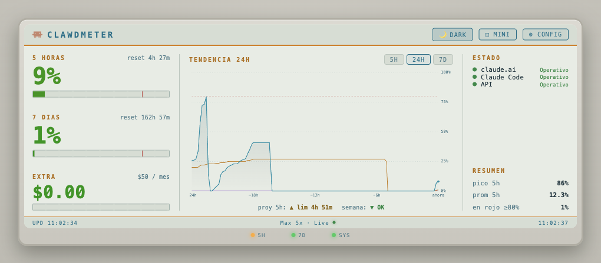
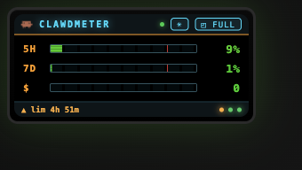

# Clawdmeter

Monitor fisico de uso de Claude en tiempo real. Un ESP32 con pantalla LCD que muestra tu consumo de Claude (limites de 5 horas, 7 dias y extra usage) consultando la API interna de claude.ai a traves de un proxy local. Incluye una PWA instalable como widget de escritorio.

<p align="center">
  <a href="https://www.waveshare.com/esp32-s3-lcd-1.47b.html">
    
  </a>
</p>

<p align="center">
  
</p>

## Como funciona

```
Brave Browser (perfil dedicado, CDP)
  -> Playwright conecta via CDP
  -> fetch a claude.ai/api (usa cookies del browser, sin API keys)
  -> Express server en localhost:3456
  -> ESP32 lee /api/usage cada 60s
  -> PWA lee /api/usage cada 60s
```

No usa API keys ni session keys. La autenticacion vive en el perfil del browser — te logueas una vez y listo.

Ademas el proxy consulta la pagina de estado oficial (**status.claude.com**, API publica, sin browser) y expone `/api/status` con el estado de claude.ai, Claude Code y la Claude API.

## Estructura

```
├── start.sh                     # Arranca Brave + proxy
├── .env                         # Config (puertos)
├── scripts/
│   └── install-autostart.sh     # Auto-arranque del proxy (LaunchAgent macOS)
├── proxy/
│   ├── server.js                # Entry point (Express + rutas)
│   ├── lib/
│   │   ├── browser.js           # Conexion Brave/CDP (resiliente: reconecta, no muere)
│   │   ├── usage.js             # Cache y refresh de datos de uso
│   │   ├── history.js           # Historico de uso en SQLite + proyeccion
│   │   ├── config.js            # Config centralizada en SQLite (la baja el ESP32)
│   │   ├── backup.js            # Backup diario de las DBs (fuera del proyecto)
│   │   └── status.js            # Estado de los servicios de Claude (status.claude.com)
│   └── public/                  # PWA (widget de escritorio)
│       ├── index.html           # Consola: uso + tendencia + estado + config embebida
│       ├── config.html          # Pagina de config standalone (fallback)
│       ├── manifest.json        # Manifest PWA
│       ├── icon.svg             # Icono de la app
│       └── sw.js                # Service worker
└── firmware/Clawdmeter/
    ├── Clawdmeter.ino           # Main (setup, loop, globals)
    ├── config.ino               # Configuracion (NVS)
    ├── colors.ino               # Backlight, gradientes, LED integrado + tira externa
    ├── alerts.ino               # Alertas por umbral (buzzer + parpadeo)
    ├── display.ino              # UI comun: mensajes, header, footer, dispatch
    ├── screen_usage.ino         # Pantalla USO (5h / 7 dias / extra)
    ├── screen_trend.ino         # Pantalla TENDENCIA (sparkline 5h + proyeccion)
    ├── screen_clock.ino         # Pantalla FECHA Y HORA
    ├── screen_weather.ino       # Pantalla CLIMA
    ├── network.ino              # WiFi (portal de config), NTP, helper de tiempo
    ├── fetch.ino                # Pedidos al proxy: config, tendencia, uso
    ├── touch.ino                # Boton touch (cambio de pantalla)
    ├── weather.ino              # Clima (Open-Meteo)
    └── webconfig.ino            # Web server de configuracion
```

## Hardware

- **Board:** Waveshare ESP32-S3 LCD 1.47" (version B)
- **Display:** ST7789, 172x320px (landscape)
- **LED integrado:** WS2812 (GPIO38) — efecto ambiental con cambio fluido de color
- **Tira externa:** 3x WS2812B encadenados (GPIO2) — muestran *estado* con fade suave: LED 5h y 7d = **proyeccion** (verde = ok / ambar = subiendo pero resetea a tiempo / rojo = tocas el limite antes del reset, igual que la PWA), LED extra = **salud del sistema** (verde fresco / ambar viejo / rojo caido)
- **Boton touch:** TTP223 (GPIO10) — toque corto: cambia de pantalla (uso / tendencia / reloj+clima); toque largo (~1s): gira la pantalla 180°
- **Buzzer (opcional):** pasivo (GPIO11 por defecto, configurable) — beep al cruzar umbrales de uso

### Conexiones

El boton touch, la tira de LEDs externa y el buzzer son los componentes a cablear; el display y el LED integrado ya vienen en la placa. El buzzer es opcional.

```
        Waveshare ESP32-S3 LCD 1.47" B
        +------------------------------------+
        |                                    |
        |      [ LCD ST7789 320x172 ]        |
        |                                    |
        |   WS2812 integrado (GPIO38)        |  <- ambiental, no se cablea
        |                                    |
        +--+-----+------+-------+-------+----+   (VBUS = 5V; en la placa dice VBUS)
         VBUS   GND   GPIO2  GPIO10  GPIO11
           |     |      |       |       |
           |     |      |       |       '---> Buzzer pasivo (+), el otro pin a GND
           |     |      |       '-----------> TTP223 I/O (touch). VCC->3V3, GND->GND
           |     |      '-------------------> Tira WS2812B DIN (LED0=5h, 1=7d, 2=extra)
           |     '--------------------------> GND comun (tira + TTP223 + buzzer)
           '-------------------------------> VBUS/5V (alimenta la tira de LEDs)

   Tira: DIN del LED0 a GPIO2; cada LED encadena DO->DIN al siguiente.
   Todos los LEDs y el buzzer comparten VBUS/5V (LEDs) y GND con la placa.
```

| Senal | Pin placa | Componente |
|-------|-----------|------------|
| Datos LEDs | GPIO2 | DIN del primer WS2812B de la tira |
| Boton | GPIO10 | I/O del TTP223 (activo alto) |
| Buzzer (opcional) | GPIO11 | "+" del buzzer pasivo (el otro pin a GND) |
| Alimentacion tira | VBUS (5V) | VCC de los 3 WS2812B |
| Tierra comun | GND | GND de la tira, el TTP223 y el buzzer |
| TTP223 VCC | 3V3 | alimentacion del modulo touch |

> La tira de LEDs necesita 5V (pin **VBUS** de la placa) y **tierra comun**. Para 3 LEDs el consumo es bajo y puede salir del VBUS de la placa; con tiras mas largas usar fuente externa.

> **Buzzer:** pasivo (se controla con PWM/tono), dos cables — uno a GPIO11 y el otro a GND. El pin es configurable desde la web UI; pines seguros: 11, 12, 13, 14, 21. Pin `0` = sin sonido (solo parpadeo del LED).

## Setup

### Proxy (Mac/PC)

```bash
# Primera vez: abrir Brave para loguearse en claude.ai
./start.sh --login

# Despues: proxy en background
./start.sh
```

Requiere: Node.js, pnpm, Brave Browser. `pnpm install` (automatico) instala Playwright y **better-sqlite3** (historico de uso). better-sqlite3 es un modulo nativo: si tu version de Node no trae binario precompilado se compila de fuente (necesita Xcode Command Line Tools + Python). El build viene pre-aprobado en `proxy/pnpm-workspace.yaml`.

#### Auto-arranque (opcional, macOS)

Para que el proxy arranque solo al iniciar sesion (asi el ESP32 nunca se queda sin datos tras reiniciar la Mac):

```bash
# Una vez, despues de haber hecho ./start.sh --login al menos una vez
./scripts/install-autostart.sh

# Para quitarlo
./scripts/install-autostart.sh --uninstall
```

Instala un LaunchAgent (`~/Library/LaunchAgents/com.clawdmeter.proxy.plist`) que corre `start.sh` al login y reintenta si el proxy se cae. Logs en `~/Library/Logs/clawdmeter.log`.

> **Importante (macOS):** el proyecto debe estar **fuera** de `Documents`, `Desktop` y `Downloads` (carpetas protegidas por privacidad/TCC). Si no, el LaunchAgent falla con `Operation not permitted`. Ubicalo por ejemplo en `~/clawdmeter`.

> **Si expira la sesion de claude.ai:** el proxy no podra traer datos y el agente reintentara cada 60s sin exito (se ve en el log). Hay que rehacer el login una vez:
> ```bash
> ./scripts/install-autostart.sh --uninstall   # frena el agente
> ./start.sh --login                            # te logueas de nuevo
> ./scripts/install-autostart.sh                # lo reinstalas
> ```

### PWA (Widget de escritorio)

1. Con el proxy corriendo, abrir `http://localhost:3456/` en Chrome
2. Click en el icono de instalar en la barra de URL
3. Se abre como ventana standalone — un widget sin barra del browser

Es una **consola unica** estilo hardware que muestra:

- **Medidores** 5 horas / 7 dias / extra con barras segmentadas tipo VU meter y tiempo para el reset
- **Tendencia** de las 3 metricas (ventanas 5H / 24H / 7D) con umbral de aviso y proyeccion ("limite en Xh" u "OK")
- **Estado de los servicios de Claude** (claude.ai / Claude Code / API, via status.claude.com) e incidentes activos
- **Resumen**: pico, promedio y % del tiempo "en rojo"
- **LEDs virtuales en el bisel** que replican la tira fisica del ESP32 (5H/7D = proyeccion, SYS = salud del proxy)

Extras: **tema claro/oscuro** y **modo MINI** (widget compacto solo-barras), ambos persistentes; **configuracion embebida** (boton CONFIG, mismo login que `config.html`). Si el proxy se cae o expira la sesion, muestra un banner de estado.

<p align="center">
  
  
</p>

### ESP32 (Arduino IDE)

1. Board: ESP32S3 Dev Module, 16MB Flash, OPI PSRAM, USB CDC On Boot Enabled
2. Librerias: TFT_eSPI, ArduinoJson, WiFiManager (by tzapu), Adafruit NeoPixel
3. Configurar `User_Setup.h` de TFT_eSPI para la placa Waveshare
4. Flashear `firmware/Clawdmeter/Clawdmeter.ino`
5. Conectar al AP "Clawdmeter-Setup" para configurar WiFi
6. Configurar IP del proxy en `http://clawdmeter.local`

## Que muestra

| Dato | Descripcion |
|------|-------------|
| 5 HORAS | Uso en la ventana de 5h + tiempo para reset |
| 7 DIAS | Uso en la ventana de 7 dias + tiempo para reset |
| EXTRA USAGE | Creditos gastados / limite mensual (en USD) |
| TENDENCIA | Pantalla con mini-grafico de las ultimas 5h + % actual + proyeccion ("Limite en Xh" u "OK") |
| ESTADO (PWA) | Servicios de Claude: claude.ai / Claude Code / API, desde status.claude.com |
| Plan | Tipo de suscripcion (Max 5x, Pro, etc.) |
| Upd | Ultima actualizacion exitosa (cambia a rojo si falla) |
| Tira LED | 3 LEDs con fade suave: 5h y 7d = proyeccion (verde/ambar/rojo), extra = salud del proxy (frescos/viejos/caido) |
| LED integrado | Color ambiental que cambia suavemente (decorativo) |
| Buzzer | Beep + parpadeo al cruzar umbral de aviso (~80%) o critico (~95%) en 5h, 7 dias y extra. Tono distinto por metrica (grave/medio/agudo), 1 beep=aviso, 2=critico |
| Inicio | Self-test al bootear: barrido de los 3 LEDs con el tono de cada alerta (verifica tira + buzzer) |

## Configuracion

La configuracion esta dividida en dos lugares:

**Bootstrap — en el ESP32** (`http://clawdmeter.local`, usuario `admin`):
- WiFi (portal AP "Clawdmeter-Setup")
- IP y puerto del proxy
- Usuario y contrasena del proxy (para bajar la config)
- Password de admin de esta pagina
- Resetear WiFi

**Comportamiento — en la PWA** (boton **CONFIG** del dashboard, login propio; tambien disponible standalone en `/config.html`):
- Intervalo de refresco, brillo LCD/LEDs, invertir pantalla, zona horaria
- Atenuacion nocturna (rango horario + brillo)
- Alertas: on/off, umbrales de aviso/critico, GPIO del buzzer
- Clima: ciudad (con buscador) o lat/lon a mano

El ESP32 **baja estos ajustes del proxy** al arrancar y cada 5 min, y los **cachea en NVS** — asi funciona offline con lo ultimo conocido. Las credenciales del proxy (usuario/contrasena) y la zona roja se guardan hasheadas/centralizadas en el proxy.

## Por que un browser?

Claude.ai bloquea requests directos (Cloudflare + TLS fingerprinting). La unica forma confiable de acceder a la API interna es desde un browser real. Brave funciona porque es un binario separado de Chrome, asi no interfiere con tu navegador principal.

---

Inspirado en [ClaudeGauge](https://github.com/dorofino/ClaudeGauge).
